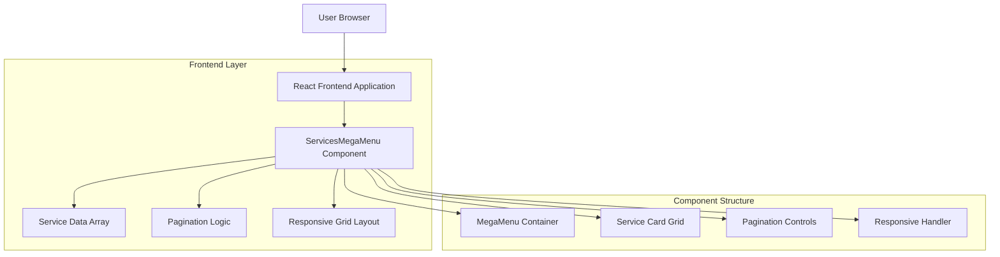
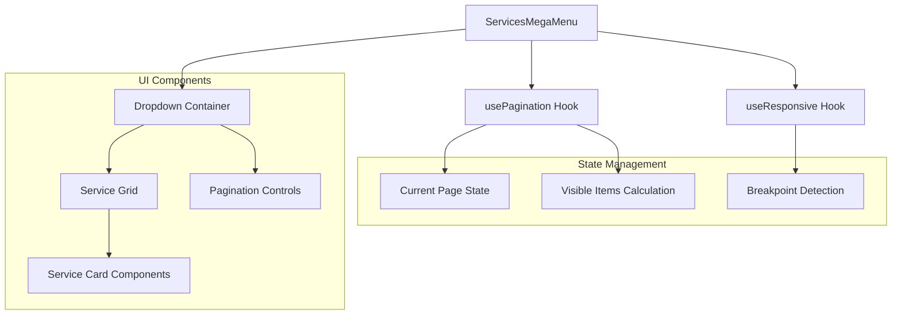

## 1. Architecture Design



## 2. Technology Description
- **Frontend**: React@18 + TypeScript + Tailwind CSS@3 + Vite
- **Initialization Tool**: vite-init
- **Backend**: None (static data configuration)
- **Key Dependencies**: 
  - @headlessui/react (for dropdown behavior)
  - lucide-react (for icons)
  - clsx (for conditional classes)

## 3. Route Definitions
| Route | Purpose |
|-------|---------|
| / | Home page with navbar containing Services mega-menu |
| /services/* | Individual service pages (linked from mega-menu) |
| /about | About page (example navigation target) |
| /contact | Contact page (example navigation target) |

## 4. Component API Definitions

### 4.1 Service Item Type
```typescript
interface ServiceItem {
  id: string;
  title: string;
  description: string;
  href: string;
  icon?: React.ComponentType<{ className?: string }>;
}
```

### 4.2 MegaMenu Props
```typescript
interface ServicesMegaMenuProps {
  items: ServiceItem[];
  columns?: number; // default: 2
  rows?: number; // default: 2
  title?: string; // default: "Overview"
  subtitle?: string; // default: "Comprehensive suite of AI and software services"
  onItemClick?: (item: ServiceItem) => void;
}
```

### 4.3 Configuration Constants
```typescript
// Default configuration
const SERVICES_MENU_COLUMNS = 2;
const SERVICES_MENU_ROWS = 2;
const MAX_COLUMNS_TABLET = 2;
const MAX_COLUMNS_MOBILE = 1;
```

### 4.4 Service Data Structure
```typescript
const servicesMenuItems: ServiceItem[] = [
  {
    id: "ai-mvp",
    title: "AI-Enabled MVP",
    description: "Rapid prototyping to validate your AI concepts before scaling.",
    href: "/services/ai-mvp",
    icon: BrainIcon
  },
  {
    id: "auction-systems",
    title: "Auction Systems",
    description: "Scalable platforms for real-time bidding and asset liquidation.",
    href: "/services/auction-systems",
    icon: GavelIcon
  },
  {
    id: "ecommerce",
    title: "Intelligent E-commerce",
    description: "Next-gen headless commerce with AI-driven personalization.",
    href: "/services/ecommerce",
    icon: ShoppingCartIcon
  },
  {
    id: "engineering-partner",
    title: "Engineering Partner",
    description: "Augment your workforce with our top-tier engineering talent.",
    href: "/services/engineering",
    icon: UsersIcon
  }
];
```

## 5. Component Architecture



## 6. Styling Configuration

### 6.1 CSS Classes
```typescript
// Container styles
const dropdownClasses = "absolute top-full left-0 mt-2 w-full min-w-[320px] max-w-[800px] bg-slate-900 rounded-lg border border-slate-700 shadow-2xl";

// Grid styles
const gridClasses = (columns: number) => `grid grid-cols-${columns} gap-4 p-6`;

// Card styles
const cardClasses = "p-4 rounded-lg border border-slate-700 hover:bg-slate-800 cursor-pointer transition-colors duration-200";

// Pagination styles
const paginationClasses = "flex items-center justify-center gap-2 p-4 border-t border-slate-700";
```

### 6.2 Responsive Breakpoints
```typescript
const responsiveConfig = {
  desktop: { minWidth: 1024, maxColumns: 4 },
  tablet: { minWidth: 640, maxColumns: 2 },
  mobile: { minWidth: 0, maxColumns: 1 }
};
```

## 7. Implementation Notes
- Component uses React hooks for state management (useState, useEffect)
- Keyboard navigation supported (arrow keys, Escape to close)
- Click-outside detection for auto-close functionality
- Smooth transitions for pagination changes
- Accessible ARIA labels and keyboard navigation
- Performance optimized with React.memo for service cards