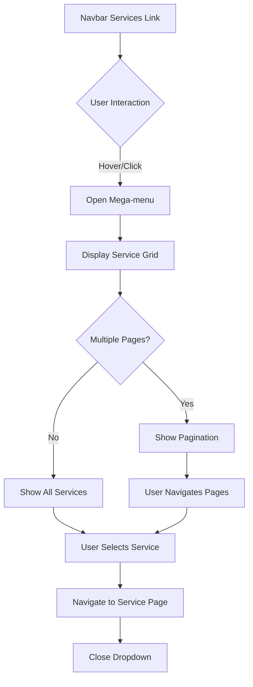

## 1. Product Overview
A responsive Services mega-menu dropdown component for navigation bars that displays service offerings in a grid layout with configurable columns/rows and pagination controls. The component provides an elegant way to showcase multiple services with titles, descriptions, and optional icons while maintaining clean navigation UX.

## 2. Core Features

### 2.1 User Roles
Not applicable - this is a UI component for all website visitors.

### 2.2 Feature Module
Our Services mega-menu consists of the following main components:
1. **Services Dropdown**: Configurable mega-menu that opens on navbar interaction
2. **Service Grid**: Responsive grid layout displaying service cards with pagination
3. **Pagination Controls**: Arrow buttons or dots for navigating between pages of services
4. **Responsive Behavior**: Adapts layout for desktop, tablet, and mobile viewports

### 2.3 Page Details
| Page Name | Module Name | Feature description |
|-----------|-------------|---------------------|
| Services Dropdown | Mega-menu Container | Dark themed dropdown panel with rounded corners, subtle border and shadow that appears below navbar Services link |
| Services Dropdown | Service Grid | CSS grid layout displaying service cards based on configured columns/rows, with configurable items per view |
| Services Dropdown | Service Card | Individual clickable cards showing service title (semi-bold), 2-line description (muted text), optional icon |
| Services Dropdown | Pagination Controls | Previous/Next arrows or dot indicators that appear when total services exceed itemsPerView, with keyboard navigation support |
| Services Dropdown | Responsive Layout | Automatically adjusts columns for tablet (max 2) and mobile (1 column) while maintaining pagination functionality |

## 3. Core Process
**User Interaction Flow:**
1. User hovers over or clicks "Services" in navbar
2. Mega-menu dropdown opens with configured grid layout
3. User views available service cards in current page
4. If multiple pages exist, user can navigate using pagination controls
5. User clicks service card to navigate to service page
6. Dropdown closes when clicking outside, pressing Esc, or selecting service

## 4. User Interface Design

### 4.1 Design Style
- **Primary Colors**: Dark navy background (#1a1a2e), white text, muted gray descriptions (#8892b0)
- **Accent Colors**: Yellow/gold for interactive elements and CTAs (#ffd700)
- **Button Style**: Rounded corners, subtle hover effects, clear disabled states
- **Typography**: Semi-bold titles, regular descriptions, consistent font sizing
- **Layout**: Card-based grid with consistent spacing and alignment
- **Icons**: Optional service icons with consistent sizing and styling

### 4.2 Page Design Overview
| Page Name | Module Name | UI Elements |
|-----------|-------------|-------------|
| Services Dropdown | Container | Dark navy background (#1a1a2e), rounded corners (8-12px), subtle border (1px solid #2a2a3e), box-shadow (0 8px 32px rgba(0,0,0,0.3)) |
| Services Dropdown | Section Header | "Overview" title (white, semi-bold, 18px), helper text "Comprehensive suite of AI and software services" (muted gray, 14px) |
| Services Dropdown | Service Card | White title (16px, semi-bold), muted description (14px, line-clamp-2), optional icon (24x24px), hover highlight (background rgba(255,255,255,0.05)) |
| Services Dropdown | Pagination | Arrow buttons with disabled states, positioned at bottom center, consistent with dark theme styling |

### 4.3 Responsiveness
- **Desktop-first**: Default to configured columns/rows
- **Tablet**: Automatically reduce columns (max 2 columns)
- **Mobile**: Full-width dropdown with 1 column layout
- **Touch optimization**: Larger tap targets on mobile, swipe gesture support for pagination

### 4.4 Configuration Requirements
- Configurable columns (1-4) and rows (1-3)
- Items per view calculated as columns × rows
- Easy configuration constants at component level
- Support for 6-12 default service items